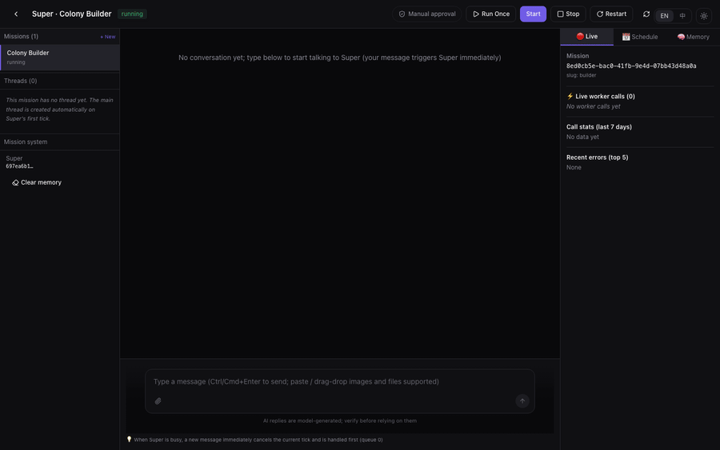

<div align="center">


# Colony（蜂群）

### 多数 AI agent 为演示而生，Colony 为干活而生。

自托管的自治任务 Agent 平台:按计划运行、调用共享工具、自我迭代。

[English](README.md) | 简体中文

[](#许可)


</div>

---

用一句话描述目标("运营我的小红书账号""监控这些信息源并筛出重要内容""持续整理我的知识库")。Colony 设计出所需的助手与 worker,排程并运行。它们无人值守地工作,重要决策前请你批准,并随时间自我改进。

你提供任意大模型的 API key。Colony 自托管,负责编排、调度、记忆与审批。

**与众不同之处**

- **一支团队,而非一次对话。** 你设定目标,Colony 搭建 agent 并按计划运行。不是一问一答。
- **持久化运行,成本可控。** Agent 按计划自动或用户主动触发执行。自动分级压缩历史上下文。
- **能力可共享。** 一项能力(如"发布到小红书")只构建一次。所有需要它的 agent 共用。
- **安全地自我改进。** 表现不佳的 worker 被自动重写。兼容性检查确保不影响其他依赖它的任务。
- **自治且可控。** Agent 自主运行。重要决策交还给你。

## 工作原理

```
你 ─描述目标→ Builder(第一个 Super)
                  │ 设计
                  ▼
            Super(角色模板) ──实例化为──▶ Mission(运行实例)
                  │ 派发                          │ 按计划运行
                  ▼                               ▼
            Workers(共享能力)               回报 / 请你审批
                  ▲                               │
                  └──── 自我迭代闭环 ◀─────────────┘
```

- **Super** —— 角色模板(skills + capabilities + protocol + model)。1 个 Super → 多个 **Mission**。
- **Mission** —— 运行实例,有自己的排程、记忆、消息**线程**(一条 `main` 对话流 + 每对 super↔worker 一条持久派发线程 + 一条健康自检线)。
- **Worker** —— 强约束的共享能力,被 Super 调用,全平台复用。
- **Builder** —— 第一个 Super;跟它对话来设计新的 Super 和 worker。

**自我迭代闭环:**一个定时健康自检线程跟踪每个 worker 的成功率,并通过 Builder 改写低成功率 worker 的协议。每次改写都过一道跨调用方兼容门([ADR-015](docs/adr/015-worker-self-iteration-and-system-objects.md)),升级不会破坏依赖同一 worker 的其它 mission。可逆改动自动生效;真正不可逆的升级给人工。

**省 token:**每次定时 tick 只拼装 inbox + 记忆 + payload(不是整段历史)+ 近重复记忆折叠 + 分级上下文压缩。

术语见 [CONTEXT.md](CONTEXT.md),架构决策见 [docs/adr/](docs/adr/)。

## 演示



*一句话目标，Builder 设计出一个带可复用 worker + 每日调度的 Super，安装工具前停下来等你审批，随后激活它 —— 新 Super 自己跑起来并规划工作。([mp4](docs/media/colony-tour.mp4))*

## 你能搭什么

每条都是对 Builder 的一句话:

| 你说… | Colony 搭出… |
| --- | --- |
| 「运营我的小红书 —— 每天发图文 + 巡评论」 | 社媒运营 Super + 内容/发布/评论 worker,每天 9 点排程 |
| 「盯这些 RSS,有重要的就汇总给我」 | 监控 Super,只汇总 + 升级真正重要的内容 |
| 「每周做竞品调研草稿」 | 调研 Super,并行派搜索 worker 汇总成报告 |
| 「维护我的知识库并据此答疑」 | 知识库运营 Super,接 pgvector 知识库 |

### Super agent 与 Worker agent

Colony 的核心区别:

| | **Super agent** | **Worker agent** |
| --- | --- | --- |
| 角色 | 编排者 —— 一个角色*模板* | 单一共享*能力* |
| 谁调用 | 你跟它对话;它按计划自运行 | 由 Super 通过 `invoke_worker(capability, action, params)` 调 |
| 复用 | 1 Super → **N 个 mission**(实例) | 1 Worker → 被**多个 Super** 复用 |
| 拥有 | 目标、方案、记忆、排程、与你的对话 | 一个窄技能(如「发小红书」「抓 RSS」) |
| 决策 | *做什么*、*何时做*;高危步骤找你审批 | *怎么执行*一个动作,返回结果 |
| 升级范围 | 按 Super | 全平台 —— 若会破坏任一在用它的 Super 则被阻断([ADR-009](docs/adr/009-builder-governance.md)) |

Super 是你一句话创建的自运行助理;Worker 是任何 Super 都能调用的共享工具。

### 为什么用 worker（而非 skill）来实现能力

skill 是固定的工具:agent 调用的一个函数。若把一项真实能力(比如"运营小红书账号")完全用 skill 拼出来,就要为每种情况堆越来越多僵硬的工具定义和分支判断。skill 层会越来越臃肿、越来越脆,每个新情况都得改代码。

worker 是一个有自己推理循环的 agent。它通过一份"动作契约"对外暴露能力,靠推理应对杂乱多变的输入:自行适应、必要时追问、出错能恢复,而不是为每种情况写死分支。一个 worker 被所有 Super 共享,按契约版本化,且只在一处改进。

所以 Colony 把 skill 留给轻量、确定性的工具;需要判断力的能力则用 worker 实现。工具层保持精简,灵活性都放在 worker 里。

### 模块

| 模块 | 作用 | 如何工作 |
| --- | --- | --- |
| **Builder** | 第一个 Super,设计其它所有 Super + Worker | 你描述目标 → 它草拟方案、请你确认 → 建 Super、复用或设计 Worker、激活 |
| **Agents**(Super / Worker) | 一站式管理所有 agent | Super 页:角色模板 + 其 mission(点 **进入工作台**)。Worker 页:共享能力 + 成功率(点 **观察**) |
| **Mission 工作台** | Super 运行的地方 | 三栏 —— 左栏(该 Super 的 **mission** 列表 + 当前 mission 的消息**线程**,均可删除)/ 实时对话流(可随时打断)/ 右栏(排程、实时 worker 调用、记忆)。每个 mission 有 **人工 / 全自动** 审批开关 |
| **Skills** | agent 可调用的工具 | 内置 skill + 从 **ClawHub** 一键安装;按 scope(super / worker / builder)绑给 agent |
| **MCP 服务器** | 外部工具接入 | 注册 stdio 子进程或 http MCP 服务,绑给需要的 worker |
| **LLM 提供商** | 模型源 | 加 OpenAI / Anthropic / Gemini / DeepSeek / Ollama / 任意 OpenAI 兼容端点,同步模型、选默认 |
| **审核渠道** | 人机协同闸门 | 绑微信机器人;Super 遇高危动作时把审批卡推给你的审批人 |
| **知识库** | 长期检索 | pgvector 存储;agent 通过 `knowledge_search` 查;scope:mission / super / platform |
| **物料库** | 结构化资产 | 元器件、模组、参考图按 id 存;agent 通过 `material_lookup` 拉取 |
| **对象存储** | 产物 | S3 / MinIO 浏览器,看 agent 产出的一切 |
| **系统设置** | 全局可调项 | 压缩、配额、超时、开发护栏 —— 保存即生效 |

## 快速开始

需要 Docker + Docker Compose v2.20+。

```bash
git clone https://github.com/liiiiwh/ColonyAgents.git colony && cd colony
cp backend/.env.example backend/.env       # 填 SECRET_KEY / ENCRYPTION_KEY(生成命令见文件内注释)
docker compose up -d                        # postgres + minio + backend + frontend
```

然后:

1. 打开 **http://localhost:3022** 登录(`admin` / `admin123` —— 请修改)。
2. 会弹出初始化向导(配好默认模型前不可关闭):先选**语言**(English / 中文 —— 决定你的界面语言 + 系统 Agent 说哪种语言),再添加 **LLM 提供商**(OpenAI / Anthropic / Gemini / DeepSeek / 任意 OpenAI 兼容端点)并同步模型。
3. 选默认 supervisor / worker 模型 —— 平台自动初始化(按所选语言播种系统 Agent)并把你带进 Builder。
4. 告诉 Builder 你想要什么。

> `scripts/install.sh` 把上述步骤包了一层并加健康探活。CI / 无头环境设 `AUTO_INSTALL=true` 跳过手动添加 provider 一步。

### 部署形态

| 文件 | 何时用 |
| --- | --- |
| `docker-compose.yml` | **全栈** —— 自带 postgres + minio + backend + frontend(各有数据卷)。一条命令,自带数据。 |
| `docker-compose.app.yml` | **仅应用** —— 只起 backend + frontend;DB(需 pgvector)和 S3 由 `backend/.env` 指向你自己托管的实例。 |
| `docker-compose.infra.yml` | **仅基础设施** —— postgres + minio,供开发时在宿主机直接跑 backend/frontend。 |

<details>
<summary>手动部署(开发)—— 代码跑在宿主机</summary>

```bash
docker compose -f docker-compose.infra.yml up -d   # postgres (pgvector) + minio

# 后端
cd backend
cp .env.example .env                                # SECRET_KEY / ENCRYPTION_KEY / DB / S3
uv sync
uv run alembic upgrade head
uv run uvicorn app.main:app --port 9022

# 前端(新终端)
cd frontend
npm install
BACKEND_URL=http://localhost:9022 npm run dev       # http://localhost:3022
```
</details>

## 配置

关键环境变量(见 [backend/.env.example](backend/.env.example)):

| 变量 | 用途 |
| --- | --- |
| `SECRET_KEY` | JWT 签名 —— 设一个强随机值 |
| `ENCRYPTION_KEY` | Fernet 密钥,加密落库的 provider API key |
| `DATABASE_URL` | Postgres(pgvector)连接 |
| `S3_*` | 对象存储(MinIO/S3)存产物 |
| `AUTO_INSTALL` | `true` 启动时自动初始化(CI/dev) |

**支持的 LLM 提供商:** OpenAI · Anthropic · Google Gemini / AI Studio · Azure OpenAI · DeepSeek · Ollama(本地)· 任意 OpenAI 兼容端点(通义千问 / 火山 / 百炼 / 代理 —— 填 `base_url`)。Colony 绝不静默降级模型([ADR-014](docs/adr/014-no-model-degradation-compat.md))。

## 安全

- 非本地使用前修改默认 admin 密码(`INIT_ADMIN_PASSWORD`)和 MinIO 凭证。
- 通过 UI 或环境变量提供 LLM key —— 绝不提交进库。`.env` 已 gitignore。
- 重新生成 `SECRET_KEY` / `ENCRYPTION_KEY`。

## 路线图

- 微信之外更多审批渠道(Slack / Telegram / 邮件)
- 版本化的 worker 能力契约
- 共享 Super/Worker 模板市场

## 许可

[MIT](LICENSE) © 2026 李文华 (Li Wenhua)

可免费商用、修改与分发,唯一要求是保留版权声明与许可证文本(署名)。

## Star History

<div align="center">

<a href="https://www.star-history.com/?repos=liiiiwh%2FColonyAgents&type=date&legend=top-left">
  
</a>

</div>
